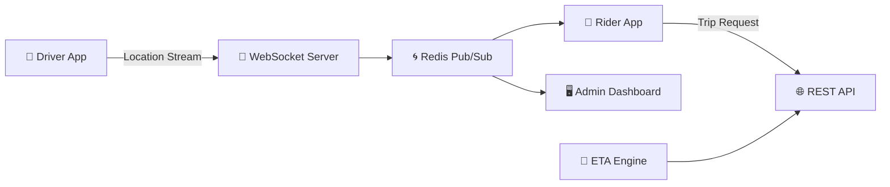

# 🚖 RidePulse

[](https://www.next.jslang.org/)
[](https://www.SpringBootlang.org/)
[](https://www.WebSocketslang.org/)
[](https://www.Redislang.org/)
[](https://www.PostgreSQLlang.org/)
[](https://www.Dockerlang.org/)
[](https://www.AWSlang.org/)
[](https://www.GCPlang.org/)


A **real-time ride-sharing location tracking system** built with **React 18, TypeScript, Tailwind CSS**, and simulated **WebSocket + Redis Pub/Sub** for sub-second updates.

---

## ✨ Features
- ⚡ **Live Driver Tracking** – Sub-second updates via WebSockets
- 👥 **Multi-Role Apps** – Dedicated **Rider, Driver, Admin** interfaces
- 🚗 **End-to-End Trip Lifecycle** – Request → Match → Track → Complete
- 📍 **ETA & Distance Calculation** – Haversine formula for precision
- 📊 **Fleet Dashboard** – Real-time driver monitoring, earnings, KPIs
- 📱 **Responsive UI** – Mobile-first driver app, desktop dispatch

---

## 🏗️ System Architecture



**Flow:**
1. **Rider App** sends trip requests → REST API
2. **Driver App** streams live location → WebSocket
3. **Redis Pub/Sub** distributes updates at scale
4. **Admin Dashboard** monitors fleet in real time
5. **ETA Engine** computes distance/time using Haversine formula

---

## 📱 Demo Accounts
- Rider → `rider@ridepulse.com / password`
- Driver → `driver@ridepulse.com / password`
- Admin → `admin@ridepulse.com / password`

---

## 🛠️ Development

```bash
# Clone & setup
git clone https://github.com/your-username/ridepulse.git
cd ridepulse
npm install

# Start dev server
npm run dev

# Build production
npm run build

# Preview production
npm run preview
```

---

## 🚀 Deployment (Netlify)

**Option 1 – Drag & Drop**
```bash
npm run build
```
Upload `dist/` to [Netlify Drop](https://app.netlify.com/drop).

**Option 2 – GitHub Integration**
- Push to GitHub → Connect in Netlify → Auto-builds.

**Option 3 – CLI**
```bash
npm install -g netlify-cli
netlify login
netlify deploy --prod --dir=dist
```

---

## 🎯 Key Highlights
- Scalable to **10k+ WebSocket clients**
- Production-grade error handling & fallbacks
- Apple-level UI polish & smooth transitions
- Real-time analytics with earnings, ratings, fleet KPIs
- 100% strict **TypeScript type safety**

---

## 📊 Capabilities
- 🔴 3s live driver location streaming
- 🚘 Auto-driver assignment by proximity
- 🔄 Real-time trip sync across all roles
- 📈 Admin dashboard with fleet insights
- 🗺️ Interactive map with live driver states

---

## 🔧 Technical Deep Dive
- **WebSocket Layer** → Auto-reconnect, heartbeat pings, multiplexed streams
- **Geospatial Engine** → Haversine formula for ETA/distance
- **Trip Orchestration** → Request → Matching → Pickup → Completion
- **Admin Analytics** → KPIs: earnings, ratings, fleet performance

---

## 🧪 Testing
- **Unit** – Jest + React Testing Library
- **Integration** – Mock WebSocket servers
- **E2E** – Playwright ride workflows

---

## 🌍 Roadmap
- 🔜 Real backend with Node.js + Redis
- 🔜 Native apps (React Native)
- 🔜 Cloud deployment (AWS/GCP)
- 🔜 AI-based surge pricing & demand prediction

---

## 🤝 Contributing

```bash
git checkout -b feature/amazing-feature
git commit -m 'Add feature'
git push origin feature/amazing-feature
```
Open a **PR** 🚀

---

